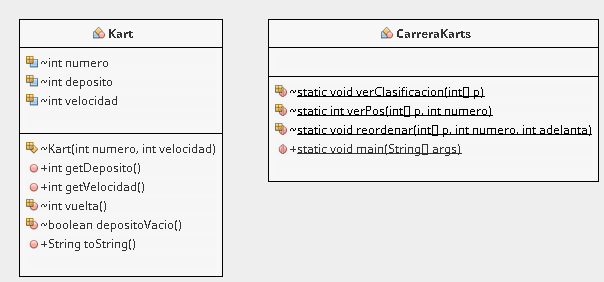

# karts
JAVA: Arrays de objetos

## Introducción

Código para realizar **simulación de una carrera de Karts**.

Para ejecutar en Netbeans, crear un proyecto nuevo y copiar la carpeta `carrerakarts` dentro del directorio `src` del proyecto.

## Diagrama de clases



Los valores que se establecen para los karts son:
- Valor por defecto para el depósito: 30 decilitros.
- Rango de velocidad: de 40 a 50.

## Resultado de la ejecución

El resultado de la ejecución del código debe generar algo parecido a lo siguiente, teniendo en cuenta que hay número aleatorios en acción:

```
Introduce nº total de karts: 10
** Coche nº 1 ** Dep. 30 ** Vel. 40
** Coche nº 2 ** Dep. 30 ** Vel. 41
** Coche nº 3 ** Dep. 30 ** Vel. 42
** Coche nº 4 ** Dep. 30 ** Vel. 43
** Coche nº 5 ** Dep. 30 ** Vel. 44
** Coche nº 6 ** Dep. 30 ** Vel. 45
** Coche nº 7 ** Dep. 30 ** Vel. 46
** Coche nº 8 ** Dep. 30 ** Vel. 47
** Coche nº 9 ** Dep. 30 ** Vel. 48
** Coche nº 10 ** Dep. 30 ** Vel. 49
CLASIF.: (10,9,8,7,6,5,4,3,2,1)
))))) VUELTA: 1
...Inicio de vuelta del coche 1
...Inicio de vuelta del coche 2
...Inicio de vuelta del coche 3
...Inicio de vuelta del coche 4
...Inicio de vuelta del coche 5
...Inicio de vuelta del coche 6
...Inicio de vuelta del coche 7
--- El coche 7 tiene un premio para adelantar.
...Inicio de vuelta del coche 8
...Inicio de vuelta del coche 9
--- El coche 9 tiene un premio para adelantar.
...Inicio de vuelta del coche 10
CLASIF.: (9,10,7,8,6,5,4,3,2,1)
))))) VUELTA: 2
...Inicio de vuelta del coche 1
...Inicio de vuelta del coche 2
...Inicio de vuelta del coche 3
...Inicio de vuelta del coche 4
...Inicio de vuelta del coche 5
...Inicio de vuelta del coche 6
...Inicio de vuelta del coche 7
...Inicio de vuelta del coche 8
...Inicio de vuelta del coche 9
...Inicio de vuelta del coche 10
--- El coche 10 tiene un premio para adelantar.
CLASIF.: (10,9,7,8,6,5,4,3,2,1)
))))) VUELTA: 3
...Inicio de vuelta del coche 1
...Inicio de vuelta del coche 2
...Inicio de vuelta del coche 3
...Inicio de vuelta del coche 4
...Inicio de vuelta del coche 5
...Inicio de vuelta del coche 6
--- El coche 6 tiene un premio para adelantar.
...Inicio de vuelta del coche 7
--- El coche 7 tiene un premio para adelantar.
...Inicio de vuelta del coche 8
...Inicio de vuelta del coche 9
...Inicio de vuelta del coche 10
CLASIF.: (10,7,9,6,8,5,4,3,2,1)
))))) VUELTA: 4
...Inicio de vuelta del coche 1
...Inicio de vuelta del coche 2
...Inicio de vuelta del coche 3
...Inicio de vuelta del coche 4
...Inicio de vuelta del coche 5
...Inicio de vuelta del coche 6
...Inicio de vuelta del coche 7
...Inicio de vuelta del coche 8
...Inicio de vuelta del coche 9
...Inicio de vuelta del coche 10
CLASIF.: (10,7,9,6,8,5,4,3,2,1)
))))) VUELTA: 5
...Inicio de vuelta del coche 1
...Inicio de vuelta del coche 2
...Inicio de vuelta del coche 3
...Inicio de vuelta del coche 4
...Inicio de vuelta del coche 5
...Inicio de vuelta del coche 6
...Inicio de vuelta del coche 7
--- El coche 7 tiene un premio para adelantar.
...Inicio de vuelta del coche 8
...Inicio de vuelta del coche 9
...Inicio de vuelta del coche 10
--- El coche 10 tiene un premio para adelantar.
CLASIF.: (10,7,9,6,8,5,4,3,2,1)
))))) VUELTA: 6
...Inicio de vuelta del coche 1
--- El coche 1 tiene un premio para adelantar.
...Inicio de vuelta del coche 2
...Inicio de vuelta del coche 3
...Inicio de vuelta del coche 4
...Inicio de vuelta del coche 5
--- El coche 5 tiene un premio para adelantar.
...Inicio de vuelta del coche 6
--- El coche 6 tiene un premio para adelantar.
...Inicio de vuelta del coche 7
--- El coche 7 tiene un premio para adelantar.
...Inicio de vuelta del coche 8
--- El coche 8 tiene un premio para adelantar.
...Inicio de vuelta del coche 9
...Inicio de vuelta del coche 10
CLASIF.: (7,10,6,9,8,5,4,3,1,2)
** Coche nº 1 ** Dep. 5 ** Vel. 40
** Coche nº 2 ** Dep. 3 ** Vel. 41
** Coche nº 3 ** Dep. 1 ** Vel. 42
** Coche nº 4 ** Dep. 2 ** Vel. 43
** Coche nº 5 ** Dep. 6 ** Vel. 44
** Coche nº 6 ** Dep. 4 ** Vel. 45
** Coche nº 7 ** Dep. 6 ** Vel. 46
** Coche nº 8 ** Dep. 7 ** Vel. 47
** Coche nº 9 ** Dep. 7 ** Vel. 48
** Coche nº 10 ** Dep. 1 ** Vel. 49
``` 
